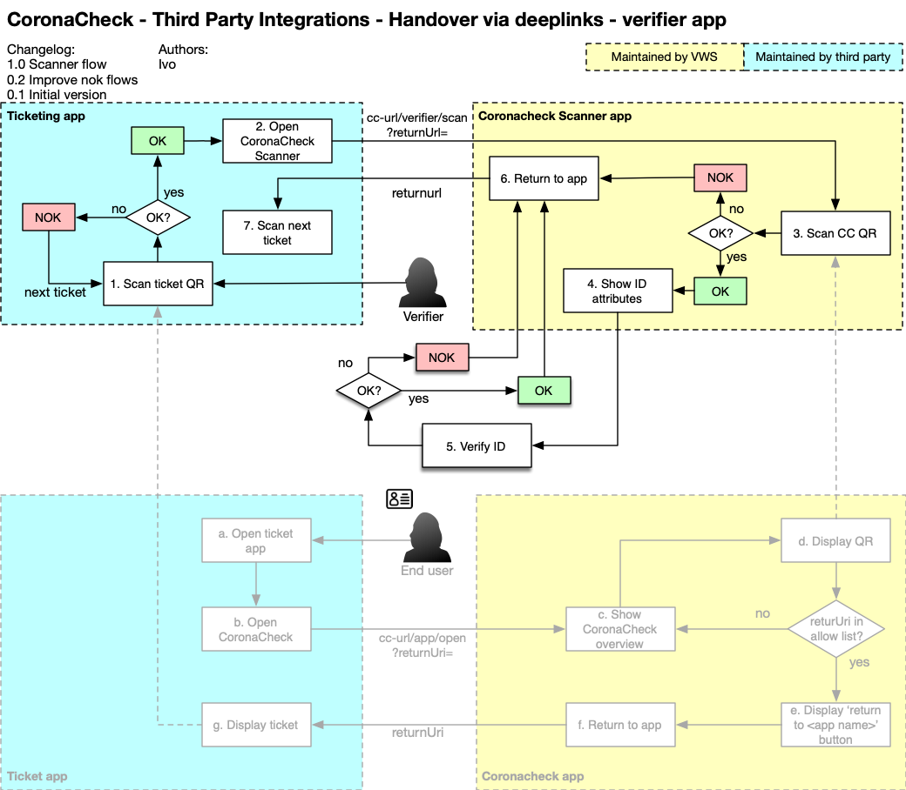

# CoronaCheck Deeplink Integration

For integration between CoronaCheck and other apps we use Universal Links. This document lists the current possible deeplinks.

## Contents

- [CoronaCheck Deeplink Integration](#coronacheck-deeplink-integration)
  * [Retrieval Code Redemption (for COVID Test Providers)](#retrieval-code-redemption--for-covid-test-providers-)
  * [Opening the CoronaCheck app to show the QR code (for ticketing apps)](#opening-the-coronacheck-app-to-show-the-qr-code--for-ticketing-apps-)
    + [Flow](#flow)
    + [Available Universal Links](#available-universal-links)
    + [Allowlisting](#allowlisting)
    + [Checking if CoronaCheck is installed](#checking-if-coronacheck-is-installed)
  * [Opening the CoronaCheck Scanner app to scan a QR code (for ticket scanner apps)](#opening-the-coronacheck-scanner-app-to-scan-a-qr-code--for-ticket-scanner-apps-)
    + [Flow](#flow-1)
    + [Available Universal Links](#available-universal-links-1)
    + [Allowlisting](#allowlisting-1)
    + [Checking if CoronaCheck Scanner is installed](#checking-if-coronacheck-scanner-is-installed)

## Retrieval Code Redemption (for COVID Test Providers)

When providing the token via a portal that the user can visit using the device where CoronaCheck is installed, the token can be directly loaded into the CoronaCheck app by utilizing the app's deeplink functionality. To use the deeplink, the token should be wrapped inside the same code that the manual entry uses (XXX-YYYYYYYYYY-ZV) The deeplink should be constructed as such:

https://coronacheck.nl/app/redeem#XXX-YYYYYYYYYYYY-ZV

If a user does not have the app installed, the URL will take the user to the CoronaCheck website, where they can find download links to download the app. If the user does have the app, this URL will automatically open the URL and fetch the test result using the token.

Note the use of the # in the URL. By using an anchor the token is not leaked to the CoronaCheck website when the user does not have the app installed.

## Opening the CoronaCheck app to show the QR code (for ticketing apps)

To find out if your app is eligible for exchanging universal links with CoronaCheck, please first [read the documentation on the Rijksoverheid site](https://www.rijksoverheid.nl/onderwerpen/coronavirus-covid-19/coronabewijs/coronacheck-voor-applicatie-providers).

### Flow 
At events where tickets are required users are typically required to first show their CoronaCheck QR code, to be scanned by the CoronaCheck scanner, and then the ticket QR code, to be scanned by a ticket scanner.

To speed up the process of showing both QR codes in sequence, we provide a deeplink integration between ticket apps and CoronaCheck. This way the user does not have to navigate manually between 2 ticket apps.

**NOTE**: No data is exchanged between the two apps, for privacy reasons. This is only a way to quickly and conveniently switch between two QR codes in different apps.

The following diagram shows the integration between 2 apps:

The ticket app opens the CoronaCheck app, telling it which URL the app should later return to. In the QR screen, a 'return to \<name of ticket app\>' button is visible for the user to directly return to the ticketing app.

### Available Universal Links  
  
The following Universal Links are available. Note that some are only in idea/planning stage, we will add support for these if we have a good use case and a test case for them.
  
Link | Behavior | Status
-----|----------|-------
https://coronacheck.nl/app/open?returnUri= | Opens the overview screen with QR cards. After opening a QR card, the QR screen will show a 'return to \<app name\>' button which will link directly to the provided returnUri. | Currently in testing phase
https://coronacheck.nl/app/open/domestic?returnUri= | Same behavior as the /app/open link, but if a domestic QR is available, it directly opens the QR. If not, is shows the home screen in domestic mode. | Idea stage
https://coronacheck.nl/app/open/dcc?returnUri= | Same behavior as the /app/open link, but if an EU DCC is available it directly opens the QR. If multiple are available, it opens the international overview screen. If none are available, it shows the home screen in international mode. | Idea stage
  
 
### Allowlisting   
  
To avoid that arbitrary apps can modify the QR screen with a return button, the CoronaCheck app uses an allow-list of domain names that it accepts as return URLs. 

To add an app to the allow-list, please follow the registration procedure documented on the [Rijksoverheid site](https://www.rijksoverheid.nl/onderwerpen/coronavirus-covid-19/coronabewijs/coronacheck-voor-applicatie-providers).
  
During this process you will be asked, among other things, for: 

  * The name of your app that should be used in the 'Return to \<app name\> button'
  * The domainname that you will use for the return urls, so we can add it to the allow-list
  * A description of how you plan to use the deeplink integration
  * The link to your Android and iOS app store entries so that we can download your app and evaluate your application

### Checking if CoronaCheck is installed 

To check if the CoronaCheck app is installed, the presence of the custom URI scheme "coronacheck://" can be checked, using typical 'canOpenURI' type operating system calls. (The Universal Links themselves are not always suitable for this since all devices can open the Universal Link if we count the presence of the website fallback).

## Opening the CoronaCheck Scanner app to scan a QR code (for ticket scanner apps)

To find out if your app is eligible for exchanging universal links with CoronaCheck Scanner, please first [read the documentation on the Rijksoverheid site](https://www.rijksoverheid.nl/onderwerpen/coronavirus-covid-19/coronabewijs/coronacheck-voor-applicatie-providers).

### Flow 
At events where tickets are required users are typically required to first show their CoronaCheck QR code, to be scanned by the CoronaCheck scanner, and then the ticket QR code, to be scanned by a ticket scanner.

To speed up the process of scanning both QR codes in sequence, we provide a deeplink integration between ticket scan apps and CoronaCheck Scanner. This way the agent does not have to navigate manually between 2 scanner apps and can scan both ticket and CoronaCheck in succession. This is very similar to the previous chapter which discussed deeplinks between ticket app and CoronaCheck app; the concept is indeed similar, but this time on the scanner side.

**NOTE**: No data is exchanged between the two apps, for privacy reasons. This is only a way to quickly and conveniently switch between two scanners in different apps.

The following diagram shows the integration between 2 apps:

The ticket scanner app opens the CoronaCheck app, telling it which URL the app should later return to. In the intials screen, a button is visible for the user to directly return to the ticketing app.

### Available Universal Links  
  
The following Universal Links are available. Note that some are only in idea/planning stage, we will add support for these if we have a good use case and a test case for them.
  
Link | Behavior | Status
-----|----------|-------
https://coronacheck.nl/verifier/scan?returnUri= | Opens the scanner screen. After scanning a QR, the initials screen will show a button which will link directly to the provided returnUri. | The button is the same as the regular button, but with an 'exit' indication indicating that instead of returning to the CoronaCheck Scanner homescreen, it returns to the calling app.  
 
### Allowlisting   
  
To avoid that arbitrary apps can modify the initials screen with a return button, the CoronaCheck app uses an allow-list of domain names that it accepts as return URLs. 

To add an app to the allow-list, please follow the registration procedure documented on the [Rijksoverheid site](https://www.rijksoverheid.nl/onderwerpen/coronavirus-covid-19/coronabewijs/coronacheck-voor-applicatie-providers).
  
During this process you will be asked, among other things, for: 

  * The name of your app that should be used in the 'Return to \<app name\> button'
  * The domainname that you will use for the return urls, so we can add it to the allow-list
  * A description of how you plan to use the deeplink integration
  * The link to your Android and/or iOS app store entries so that we can download your app and evaluate your application. If your scanner app is not available through the public app store, please provide us with a way to install/evaluate your scanner app (e.g. by supplying us with the .apk file of your scanner app)

### Checking if CoronaCheck Scanner is installed 

To check if the CoronaCheck Scanner app is installed, the presence of the custom URI scheme "coronacheck-verifier://" can be checked, using typical 'canOpenURI' type operating system calls. (The Universal Links themselves are not always suitable for this since all devices can open the Universal Link if we count the presence of the website fallback).

<small><i><a href='http://ecotrust-canada.github.io/markdown-toc/'>Table of contents generated with markdown-toc</a></i></small>
