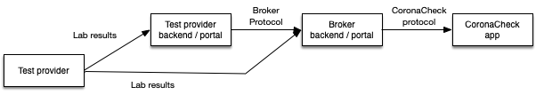
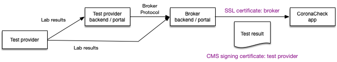

# Using a broker for connecting with CoronaCheck

## Introduction

Some providers make use of the services of brokers/intermediaries that handle the connection with the CoronaCheck app. 

How the interaction between test provider and broker work is up to the broker. The following diagram has a two common routes:

In this diagram you see an example of a full service broker, where the test provider only delivers test results and the broker takes care of everything. The other route is via a backend at the test provider, where the broker only provides the connection with the CoronaCheck app. Other scenario's may exist - this is only an example.

## PKI-O certificates in a broker context

For the CoronaCheck app there is no difference between a direct connection and a brokered connection. The same protocol is applied. But when it comes to the use of PKI-O certificates for signatures and SSL connections, there is an important aspect:

* The party responsible for the SSL connection should use their PKI-O SSL certificate. This way the app can determine that it is correctly connecting to the broker's endpoint.
* The party responsible for test results should use their PKI-O signing certificate. This way the test provider is still responsible for the authenticity and correctness of the provided test result.

The following diagram explains this graphically:

