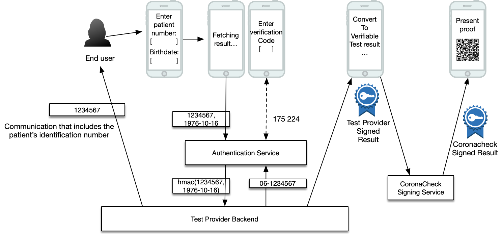

# Providing Vaccination / Test / Recovery / Assessment Events by Patient ID


* Version 1.0
* Authors: Ivo, Mendel, Nick

## Contents

- [Providing Vaccination / Test / Recovery / Assessment Events by Patient ID](#providing-vaccination---test---recovery---assessment-events-by-patient-id)
  * [Contents](#contents)
  * [Overview](#overview)
    + [Process diagram](#process-diagram)
    + [Process steps](#process-steps)
  * [Requirements](#requirements)
  * [Patient ID Hash](#patient-id-hash)
  * [JWT Tokens](#jwt-tokens)
  * [Protocol versioning](#protocol-versioning)
  * [Api Endpoints](#api-endpoints)
    + [Retrieve user phone/e-mail](#retrieve-user-phone-e-mail)
      - [Request](#request)
      - [Response](#response)
    + [Information Available](#information-available)
      - [Request](#request-1)
      - [Response](#response-1)
      - [JWT Token](#jwt-token)
    + [Events Api](#events-api)
      - [Request](#request-2)
      - [Response](#response-2)
      - [JWT Token](#jwt-token-1)
    + [Error states](#error-states)
  * [CMS Signature algorithm](#cms-signature-algorithm)
  * [Changelog](#changelog)

<small><i><a href='http://ecotrust-canada.github.io/markdown-toc/'>Table of contents generated with markdown-toc</a></i></small>


## Overview

One of the main routes of user authentication for the CoronaCheck apps is [login via DigiD](providing-events-by-digid.md). For a significant amount of users DigiD is not available however, for example because a person does not have a BSN number. For negative tests, which lead to short-lived proofs, we typically use [retrieval codes](providing-events-by-token.md), but for longer-lived proofs such as vaccination certificates this isn't the most ideal authentication method. Therefor, this document describes a third alternative: authenticating users using a 'passwordless' approach directly via the event provider.

For providers who have already implemented the DigiD based route, adding this route is fairly easy, as long as the provider has the following data on hand:

* The unique Patient ID for a patient at the provider (in short the 'user identifier')
* The patient's full birth date
* A cellphone number of the patient
* If a cellphone number is not available, the e-mail address of the patient

### Process diagram

The following diagram depicts the login process graphically, including the steps the data follows through the various systems:



### Process steps

For the user, the process contains the following steps:

1. They indicate they want to retrieve their data using their patient id.
2. They enter the patient id they received (for example in a confirmation mail) and their birthdate (something they know).
3. Based on these 2 elements the provider looks up a phone number.
4. The authentication service sends a short-lived authentication code to the user's phone (or email).
5. The user enters the verification code into the login dialog.
6. If correct, the user is authenticated and their data is retrieved.

## Requirements

In order to be able to deliver vaccination, test or recovery events to CoronaCheck via this route, a data source MUST do the following:

* Provide three endpoints:
  * A public endpoint that an app can use to determine if a system contains information belonging to a person.
  * A public endpoint that an app can use to retrieve events on behalf of the citizen, e.g. https://api.acme.inc/resultretrieval, according to the specs laid out in this document.
  * A private (server to server) endpoint to retrieve a patient's cellphone number / email address
* Obtain a x509 certificate for CMS signing events.
  * Use this certificate to sign all data responses.
  * Provide the public key of the X509 certificate to the CoronaCheck system so that signed results can be verified against the certificate.
  * Certificate must following the requirements outlined in the [Certificate Guide](certificate-guide.md)
* Obtain another x509 certificate to secure the https endpoints
  * Use this certificate to secure the https end points
  * Provide the public key of the X509 certificate to the CoronaCheck system so that endpoints can be verified by TLS pinning.
  * Certificate must following the requirements outlined in the [Certificate Guide](certificate-guide.md)
* Arrange an OIDC based authentication service that lets the user enter their data and will send out verification codes via sms/email (a simple, open source authentication service will be made available that providers can choose to host within their infrastructure).

## Patient ID Hash
Providers who have previously implemented the DigiD route will recognize this chapter; the hashing process is the same, just the fields that are used in the hash differ).

In order to reliably determine a system contains information about a certain person without revealing who that person is a `patient-id-hash` will be generated for each individual connected party and sent to the Information endpoint. 

Since only the designated party may check the hmac, a secret `hash key` is added. The `hash key` will be determined by the authentication service and shared privately with the provider. 

The hmac will be created using the following items:

- Patient id (as-is, without leading zeroes, as the user would enter it)
- Full birthdate in YYYY-MM-DD format, with leading zeroes, e.g. 1976-01-01

The `patient-id-hash` can be generated as follows:

```shell
echo -n "<Patient ID>-<Date Of Birth as YYYY-MM-DD>" | openssl dgst -sha256 -hmac "<hash key>" 
```

For example:
- Patient ID: 1234567
- Birth date: 1976-10-16
- Secret Hash Key: ZrHsI6MZmObcqrSkVpea

```shell
echo -n "1234567-1976-10-16" | openssl dgst -sha256 -hmac "ZrHsI6MZmObcqrSkVpea" 
```

Will return: `cc0187181eedbfd169fb5e2ce60392da6916282fc60d01b403a1649525054d61` as the `patient-id-hash`

Code sample in python:

```python
h = hmac.new(b'ZrHsI6MZmObcqrSkVpea',digestmod='sha256')
h.update("1234567-1976-10-16".encode('utf-8'))
print h.digest().hex()
```


## JWT Tokens
In order to authenticate to the API endpoints mentioned below, each request will contain a JWT token. 

All JWT tokens are signed by the provider (or their authentication service) using a public/private keypair in the 'RS256' format. Provider and authentication service will have to exchange the used keys in a secure manner. 

The provider MUST validate the signature in the token. Only tokens signed with the established key should be considered by the api endpoint(s).

Example of the generic fields of a CoronaCheck JWT token:

```javascript
{
    "iss": "<authentication service supplied string>",
    "aud": "<audience reference indicating the provider>",
    "userHash": "cc0187181eedbfd169fb5e2ce60392da6916282fc60d01b403a1649525054d61",
    "nonce": "5dee747d0eb7bccd22a6bb81e4959906aecd80bd0ebf047d",
    "iat": 1622214031,
    "nbf": 1622214031,
    "exp": 1623423631
}
```

Request specific contents of the JWT tokens are documented in the definition of each api endpoint. For providers who have already implemented the digid route: only the `userHash` part of the jwt is different (it replaces the `idHash`) and the issuer is not VWS but the authentication service.

When evaluating the JWT, the API endpoint should check:
* Whether the JWT has a valid signature
* Whether the expiration is in the future (`exp` field)
* Note: if you validate the issuer (`iss`) check only if it ends in `coronacheck.nl` as different prefixes might be used depending on infrastructure changes.

## Protocol versioning

The request to all endpoints contains a `CoronaCheck-Protocol-Version`. This should be considered a content negotiation. The app will always pass the highest version it supports. Providers should however return the JSON responses in the highest version they support.

For example, the app gets an upgrade and supports a new version, `CoronaCheck-Protocol-Version: 5.0`. Providers who haven't upgraded to this new version, can continue to return 3.0 responses (`"protocolVersion": "3.0"`) until they implement version 5 themselves. This way, the app and provider endpoints can be upgraded independently, with the app always having a headstart. The app will continue to support older versions until they are phased out. Information about protocol versions in use can be found in the [migration guide](migration-guide.md).

## Api Endpoints

This chapter explains the endpoints that a provider must implement.

### Retrieve user phone/e-mail 

The authentication service calls the private provider endpoint to find out the phone number to send a one-time login verification code to.

#### Request

In `cURL` the request looks as follows:
```
curl
  -X POST
  -H 'CoronaCheck-Protocol-Version: 3.0'
  -d '{ "userhash": "cc0187181eedbfd169fb5e2ce60392da6916282fc60d01b403a1649525054d61" }'
  https://api.acme.inc/userinfo
```

Notes:

* The authentication service and this provider endpoint should authenticate each other via mutual TLS autnentication.
* HTTP POST is used instead of a GET to aid in preventing logging/caching of the token or code.
* The `userhash` property is all lower case.

#### Response

The response (CMS Signed) should be provided as follows:
```javascript
{
    "protocolVersion": "3.0",
    "providerIdentifier": "XXX",
    "phoneNumber": "06-123456789", // Formatting of the phone number is arbitrary, all common formats are supported by the auth service.
    "email": "me@acme.inc"
}
```

Notes: 
* One of the two fields `phoneNumber` and `email` should always be filled. 
* Providers should only populate one of the two fields, with phoneNumber having the preference. 
* If still both are filled, the authentication service will ignore the email and only use the phone number. 


### Information Available 

In order to determine if a person is present in the provider's system a hash is sent to the first endpoint. The identity-hash is included inside the JWT token provided in the `Authorization: Bearer <JWT Token>` header.

#### Request

In `cURL` the request looks as follows:
```
curl
  -X POST
  -H 'Authorization: Bearer <JWT TOKEN>'
  -H 'CoronaCheck-Protocol-Version: 3.0'
  -d '{ "filter": "vaccination", "scope": null }'
  https://api.acme.inc/information
```

Notes:

* The useragent will be anonimized.
* HTTP POST is used instead of a GET to aid in preventing logging/caching of the token or code.

The filter and scope parameters have been documented in the (digid route)[providing-events-by-digid.md], so won't be repeated here.

#### Response

The response has been documented in the (digid route)[providing-events-by-digid.md], so won't be repeated here. The expected output is exactly the same regardless of whether DigiD or Patient ID authentication are used.

#### JWT Token

This request has no additional JWT fields other than the standard set.

### Events Api
If the Information Available api returns `true` the app will follow up with a second request in order to get the actual vaccatination events. This time the JWT token will contain two items, the user-hash and the actual user identifier. The user identifier inside the JWT token is encrypted.

#### Request

In `cURL` the request looks as follows:
```
curl
  -X POST
  -H 'Authorization: Bearer <JWT TOKEN>'
  -H 'CoronaCheck-Protocol-Version: 3.0'
  -d '{ "filter": "vaccination", "scope": null }'
  https://api.acme.inc/events
```

#### Response

The response has been documented in the (digid route)[providing-events-by-digid.md], so won't be repeated here. The expected output is exactly the same regardless of whether DigiD or Patient ID authentication are used.

#### JWT Token
In addition to the standard JWT token fields documented earlier, the JWT token for the event request will contain:

* `userIdentifier`: The Patient's unique identifier (for example a patient number) in an encrypted format. 
* `roleIdentifier`: Identifies the role of the requesting entity. CoronaCheck will set this to `01` ('Subject of care'), when the requesting entity is represented by the provided bsn. 

The encryption of the BSN is done using libsodium public/private sealboxes (X25519). The private key that can be used to decrypt the patient ID must remain with the provider at all times. The public key has to be exchanged with the authentication service.

### Error states


## CMS Signature algorithm

The CMS signing process has been documented in the (digid route)[providing-events-by-digid.md], so won't be repeated here. 

## Changelog

1.0
* Initial version of the patient id based flow.
